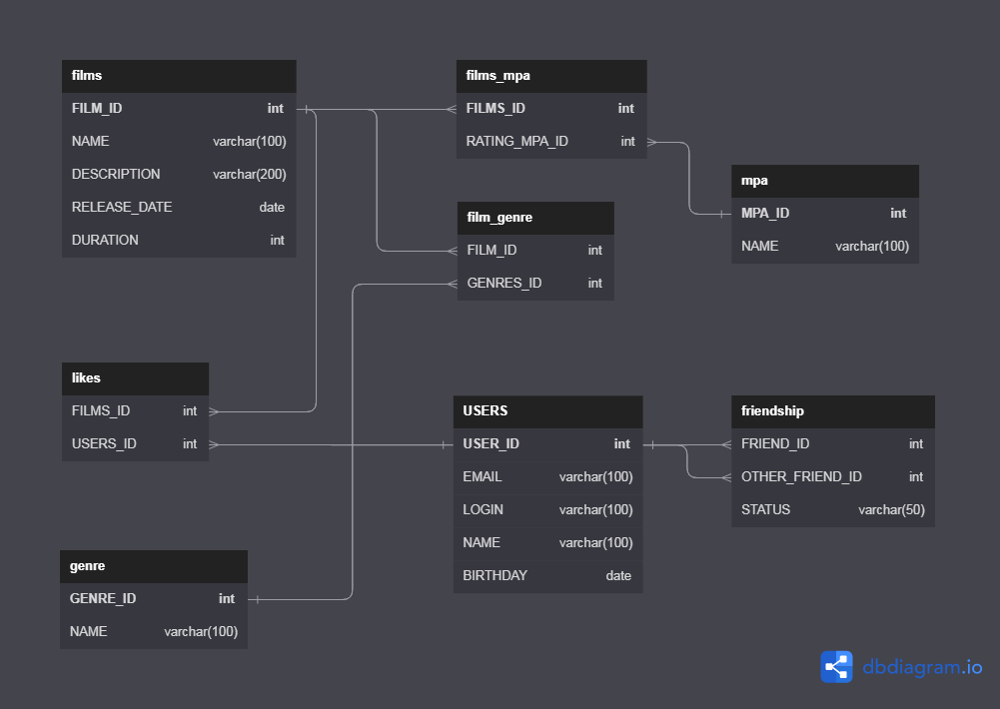

# java-filmorate
Data-base diagram:

Samples of queries:

All users query:
SELECT * FROM users;

All films query:
SELECT * FROM films;

Film likes query:
SELECT users_id FROM likes WHERE films_id=film_id;
